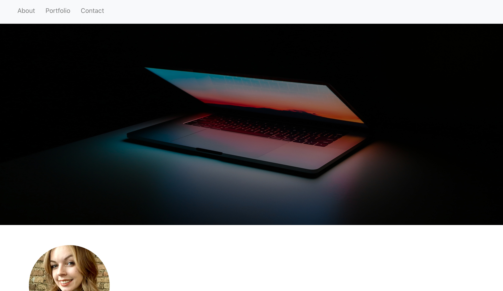

# Unit 20 React Homework: React Portfolio

# Genral Info
> A web app of my portfolio of my past projects, about me section, and a contact section.

## Table of contents
* [General info](#general-info)
* [Link](#Link)
* [Screenshot](#screenrecording)
* [Technologies](#Technologies)

## Link
Deployed App:https://aida-blin.herokuapp.com/

## Screenshot

## Technologies
1. React
2. HTML
3. React
4. Heroku
5. CSS
6. Axios
7. Express
8.Bootstrap

